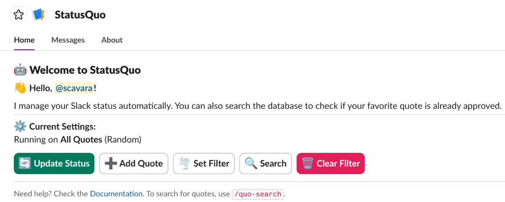

# StatusQuo 🤖

    

**StatusQuo** is a serverless Slack bot that automates your digital presence. It runs on a daily schedule to update your Slack status with witty quotes, keeping your profile fresh without manual effort.

> 💡 **Built with AI:** This entire project—from system architecture to the Python implementation—was created in collaboration with **Google Gemini**.

Unlike simple cron scripts, StatusQuo features a **"Human-in-the-Loop" workflow**: users can propose new quotes via Slack commands, but they trigger an interactive approval flow for an admin before hitting the production database.

---

## 📸 Demo


---

## 🏗️ System Architecture

This project uses a hybrid cloud approach, leveraging **Heroku** for compute (Dynos) and **AWS** for serverless storage.

```mermaid
graph TD
    User((User)) -->|/add-quote| Slack[Slack Interface]
    Slack -->|Socket Mode| App[Heroku Worker]
    App -->|Check Logic| Logic{Approval?}
    Logic -- No --> Admin[Admin Channel]
    Admin -- Approve --> App
    App -->|Save| DB[(AWS DynamoDB)]
    
    Scheduler[APScheduler] -->|09:00 AM Trigger| App
    App -->|Fetch Random Quote| DB
    App -->|API Call| API[Slack Web API]
    API -->|Update Status| Profile[User Profile]
